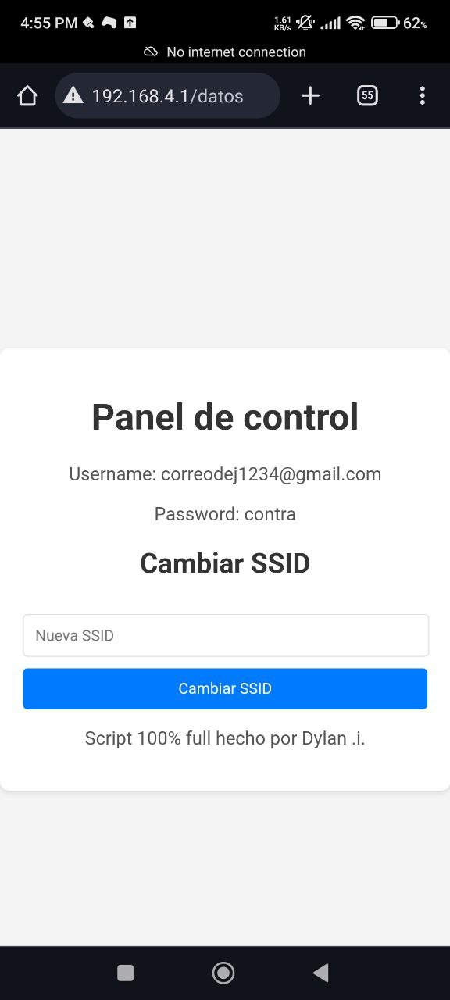
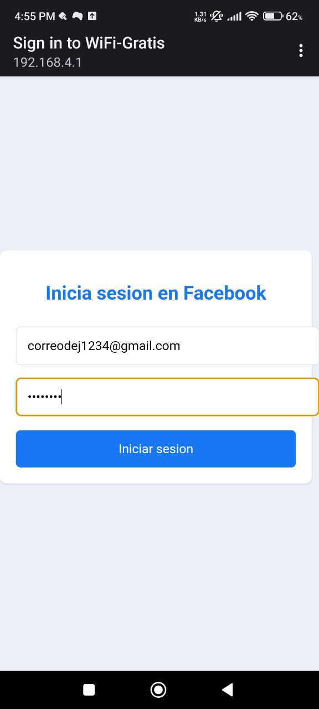

# ESP-Network-Phisher
WiFi Phisher es una herramienta diseñada para la ciberseguridad. Este proyecto utiliza un ESP32 o ESP32/8266 para crear un portal cautivo que emula una página de inicio de sesión de Facebook, capturando credenciales de usuarios desprevenidos. Además, permite la administración dinámica de la SSID del punto de acceso para adaptarse a diferentes entornos de prueba. WiFi Phisher es ideal para principiantes por su facilidad de usar y educar sobre los riesgos de ataques de phishing en redes WiFi.

## Características

- Configuración sencilla y rápida del portal cautivo.
- Captura de credenciales de usuario (nombre de usuario y contraseña).
- Interfaz web atractiva y fácil de usar.
- Opción para cambiar la SSID del punto de acceso directamente desde la interfaz web.
- Ideal para pruebas de penetración y demostraciones de seguridad.

## Advertencia

Este proyecto debe ser utilizado únicamente con fines educativos y en entornos controlados. El uso indebido de esta herramienta para acceder a información sin autorización es ilegal y éticamente incorrecto.

## Requisitos

### Cómo Configurar y Ver Credenciales

1. **Conectar al Hotspot:**
   - Enciende el ESP32/8266 y asegúrate de que esté creando un punto de acceso WiFi.
   - En tu dispositivo (computadora, teléfono o tableta), busca y conéctate a la red WiFi creada por el ESP32/8266. La SSID predeterminada es `Wifi-Libre`.

2. **Abrir el Navegador:**
   - Una vez conectado al hotspot, abre tu navegador web preferido.

3. **Acceder al Panel de Control:**
   - En la barra de direcciones del navegador, ingresa la siguiente URL: `http://192.168.4.1/datos` y presiona Enter.

4. **Interacción en la Página:**
   - En la página de control, encontrarás un campo para ingresar una nueva SSID. Aquí puedes cambiar el nombre de la red WiFi del ESP32/8266.
   - También se mostrarán las últimas credenciales ingresadas en el formulario de inicio de sesión del portal cautivo.

5. **Guardar Cambios:**
   - Introduce el nuevo nombre de red (SSID) en el campo correspondiente y haz clic en "Cambiar SSID" para actualizar la configuración del hotspot.
   - La red WiFi se reiniciará automáticamente con la nueva SSID, y deberás reconectarte a la nueva red para seguir usando el portal.

## Uso

1. Configure y cargue el código en su ESP32/8266.
2. Conéctese al punto de acceso generado por el ESP32/8266.
3. Acceda a la interfaz web para ver y gestionar las credenciales capturadas.
4. Cambie la SSID del punto de acceso si es necesario.

# Imagenes

